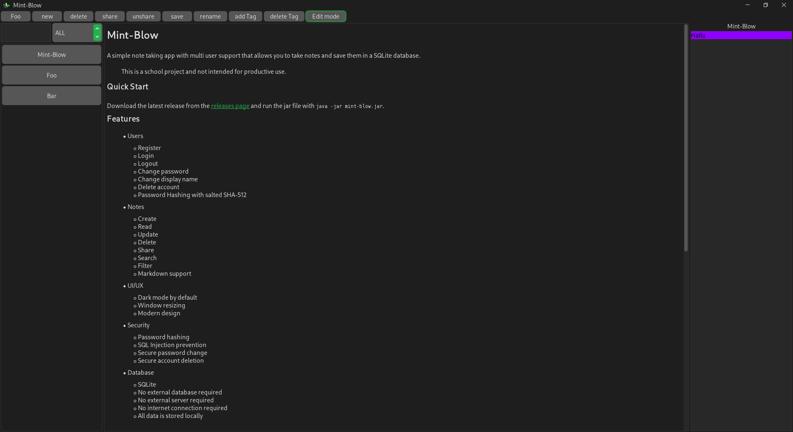

# Mint-Blow 

A simple note taking app with multi user support that allows you to take notes and save them in a SQLite database.

> [!CAUTION]
> This is a school project and not intended for productive use.

## Quick Start
Download the latest release from the [releases page]() and run the jar file with `java -jar mint-blow.jar`.

Now you can create an account and start taking notes!

## Features
- Users
  - Register
  - Login
  - Logout
  - Change password
  - Change display name
  - Delete account
  - Password Hashing with salted SHA-512
- Notes
  - Create
  - Read
  - Update
  - Delete
  - Share
  - Search
  - Filter
  - Markdown support
- UI/UX
  - Dark mode by default
  - Window resizing
  - Modern design
- Security
  - Password hashing
  - SQL Injection prevention
  - Secure password change
  - Secure account deletion
- Database
  - SQLite
  - No external database required
  - No external server required
  - No internet connection required
  - All data is stored locally

## Screenshots

### Login

### Register

### App

### Read Mode

## Compiling

> [!IMPORTANT]
> You need to have Java 21 installed on your system to compile the project.

### Linux & macOS
1. Jump into the project directory
2. run `./gradlew build` in the terminal
3. The jar file will be located in `./app/build/libs/`
4. Run the jar file with `java -jar mint-blow.jar`
5. Enjoy!

### Windows
1. Jump into the project directory
2. run `gradlew.bat build` in the command prompt
3. The jar file will be located in `.\app\build\libs\`
4. Run the jar file with `java -jar mint-blow.jar`
5. Enjoy!

## Diagrams
### Class Diagram

### Er Diagram

### Relational Schema
PRIMARY KEY: **bold**, FOREIGN KEY: *italicized*

|Relations|
---
|notes (**id INT**, *username TINYTEXT*, heading TEXT, text TEXT)|
|users (**username TINYTEXT**, displayName TINYTEXT, passwordSalt TINYTEXT, passwordHash TEXT)|
|tags (*noteID INT*, tag TINYTEXT)|
|permissions (*noteID INTEGER*, *username TINYTEXT*, permissionMode BIT)|

## Credits
- [SQLite JDBC](https://github.com/xerial/sqlite-jdbc/)
- [FlatLaf](https://www.formdev.com/flatlaf/)
- [Commonmark](https://commonmark.org/)